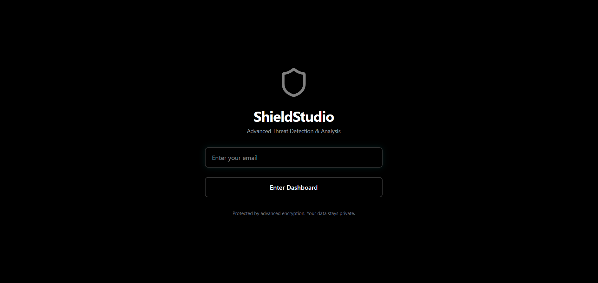
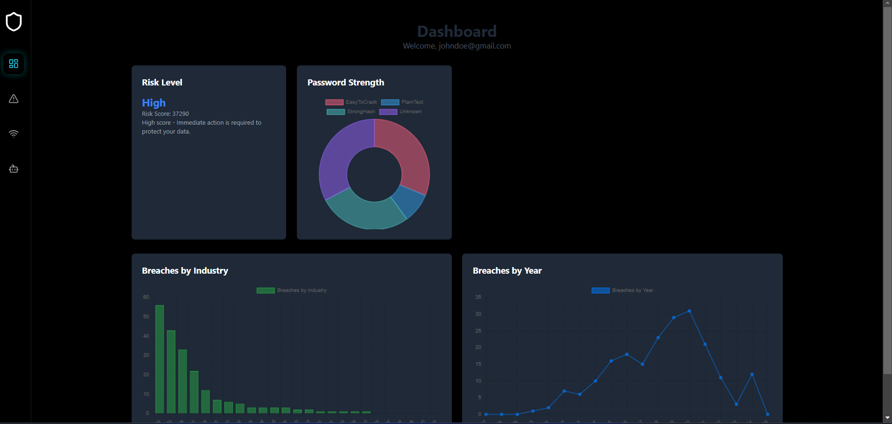
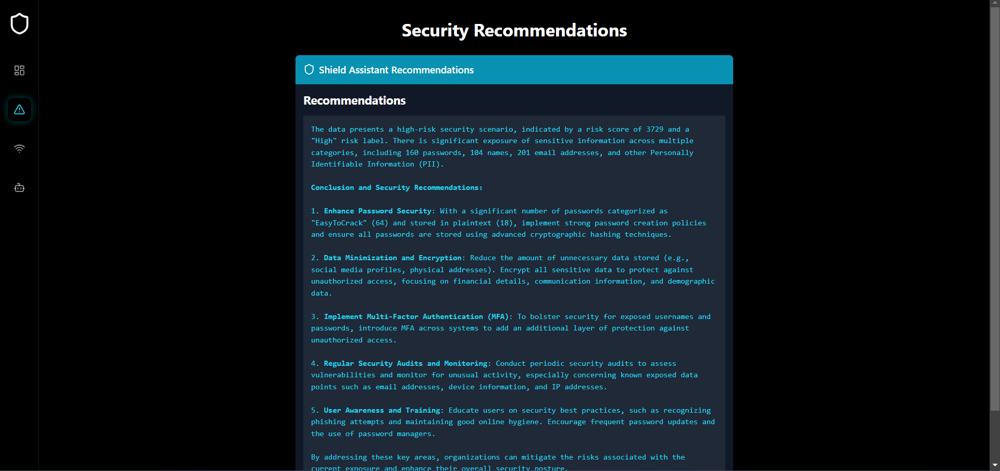
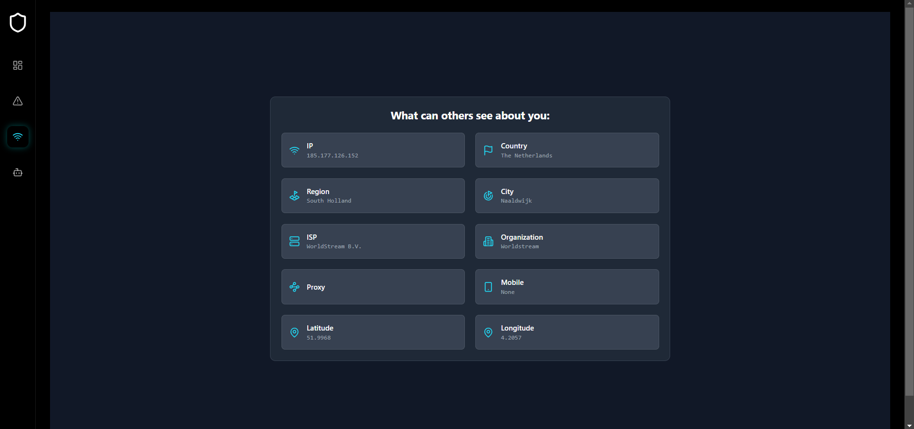
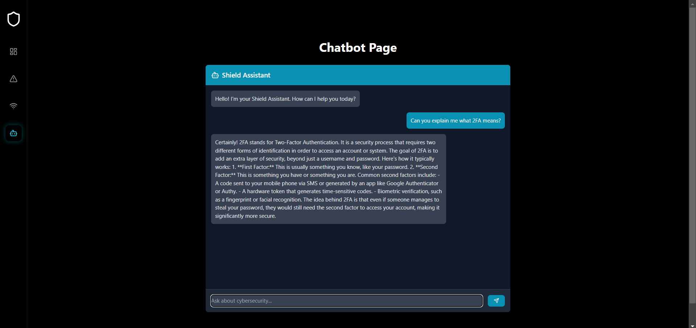

# ShieldStudio

ShieldStudio is a comprehensive web application designed to enhance email security by analyzing potential breaches and offering tailored recommendations. By leveraging the **XposedOrNot API** and integrating **OpenAI**, ShieldStudio provides users with in-depth insights into their cybersecurity posture.

## 🚀 Features

- **📊 Dashboard** – Provides a visual overview of breach metrics, including risk levels, password strength, breach trends by industry, and breaches by year.
- **🛡️ Threats & Recommendations** – AI-driven security suggestions based on breach data to help users strengthen their security.
- **🌐 Network Details** – Displays key network-related insights, including IP, geolocation, and ISP information.
- **🤖 Cybersecurity ChatBot** – An AI-powered assistant for answering cybersecurity-related questions.

## 🛠️ Technologies Used

- **React** – Frontend framework for building a dynamic user interface.
- **Chart.js** – Library for rendering interactive data visualizations.
- **Axios** – HTTP client for API communication.
- **OpenAI API** – Provides AI-driven security recommendations.
- **Tailwind CSS** – Utility-first CSS framework for responsive and modern styling.
- **[XposedOrNot API](https://xposedornot.com/)** – Checks for email breaches and provides breach-related insights.
- **[IP-API](https://ip-api.com/)** – Provides geolocation and network information based on IP address.

## 📥 Installation

Follow these steps to set up ShieldStudio on your local machine:

1. **Clone the repository**:
    ```bash
    git clone https://github.com/AndreiTihoc/ShieldStudio.git
    cd ShieldStudio
    ```

2. **Install dependencies**:
    ```bash
    npm install
    ```

3. **Set up API key**:
    - Open `src/openaiApi.ts` and replace the following line with your OpenAI API key:
    ```typescript
    const API_KEY = 'YOUR_OPENAI_API_KEY';
    ```

4. **Start the development server**:
    ```bash
    npm start
    ```

## 🎯 Usage

### **Dashboard**
- Displays breach metrics and security visualizations.
- Shows risk levels, password strength, breaches by industry, and breaches by year.

### **Threats & Recommendations**
- Fetches and displays AI-driven security recommendations.
- Notifies users if their email appears safe.

### **Network Details**
- Provides information on IP, geolocation, ISP, and network security insights.

### **ChatBot**
- AI-powered Shield Assistant for answering cybersecurity-related queries.

## 📸 Screenshots

### Starting Page


### Dashboard Page


### Recommendations Page


### Network Page


### Chatbot Page



## 📜 License

This project is licensed under the **MIT License**. See the [LICENSE](LICENSE) file for details.

## ⚠️ Disclaimer

**ShieldStudio** is provided "as-is" without warranties. The developers are not liable for any security breaches, data loss, or issues arising from the use of this application. Users are advised to exercise caution and adopt additional security measures.

---

**👨‍💻 Developed by Tihoc Andrei**  
📩 For inquiries or support, contact **tihocandrei@gmail.com**
